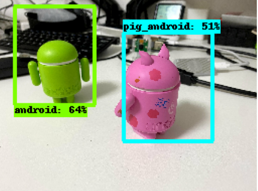

# Object Detection 2

An attempt to apply the code from the object detection example, which is about blood cell types,
to the examples from the mediapipe example, which are about android figurines.

* __sh setup.sh__ get the data.
* __python3 train.py__ run the trainer.
* __python3 eval.py__ to run inference and view results.

